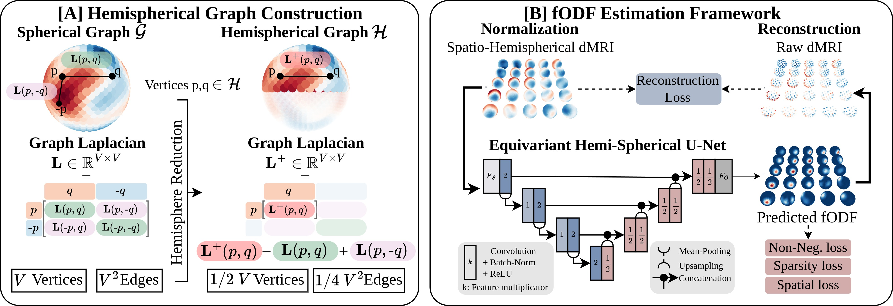

# Spatio-hemispherical equivariant convolution for dMRI deconvolution

This repository is the official implementation of [Spatio-hemispherical equivariant convolution for dMRI deconvolution](TBD), presented at Neurips 2024. The main application pertains to fODF estimation in diffusion MRI, but is applicable to any spatio-spherical problem with assumed antipodal spherical symmetry in the spherical domain. This work build upon [E3 x SO3 Equivariant Networks for Spherical Deconvolution in Diffusion MRI](https://openreview.net/pdf?id=lri_iAbpn_r), proposing a more efficient spatio-spherical convolution layer.


**A deconvolution visualization** comparing recovered fiber orientation distribution functions (fODFs) produced by the widely-used iterative *CSD* [tournier2007] model (**top row**) and our proposed *SHD-TV* model (**bottom row**) with high-resolution / clinically-infeasible (**left**) and low-resolution / clinically-feasible (**right**) spherical sampling. At high-resolutions (**left**), *SHD-TV* demonstrates enhanced localization of fiber orientations, heightened sensitivity to small-angle crossing fibers, and improved spatial consistency in the recovered fibers. At clinical low-resolutions (**right**), *CSD* struggles with the loss of input information, whereas our approach exhibits greater robustness to resolution losses and single-shell imaging protocols, yielding higher fidelity and spatially coherent fODFs.


### Overview of the proposed hemispherical graph convolution and the fODF estimation framework


**[A.]** Assuming antipodal spherical spatio-spherical signal, we reduce the spherical graph ($\mathcal{G},\mathbf{L}$) to an hemispherical graph ($\mathcal{H},\mathbf{L}^+$), reducing memory usage and increasing convolution speed. **[B.]** The SHD deconvolution framework operates on a grid of spherical signals and reduces computation complexity while improving neuronal fiber deconvolution.

### fODF estimation example: Spherical Constrained Deconvolution vs. Spatio-Hemispherical Deconvolution


## 1. Getting started

Set up the python environment:

Either using the provided yaml file:
```setup
conda env create -f env.yml
```

Or installing each package separately:
```setup
conda create -n hsd python=3.12
conda activate hsd
pip install torch torchvision torchaudio
pip install matplotlib tensorboard
pip install pyyaml
pip install joblib
pip install h5py
pip install nibabel
pip install healpy
pip install scipy
pip install pygsp
pip install pandas
conda install -c mrtrix3 mrtrix3
```

## 2. fODF deconvolution training and testing scripts

### 2.1 Prepare the diffusion MRI data

In a root folder:
* Copy your diffusion MRI data (resp. the mask) as a nifti file under the name **features.nii.gz** (**mask.nii.gz**). 
* Copy your bvecs and bvals files under the names **bvecs.bvecs** and **bvals.bvals**. Optionnaly, you can add a **bvecs_mask.txt** file if you want to mask some of the bvecs in the input of the model (usefull for super resolution training).
* In the root folder, create a folder for the response functions, called **response_functions**. There, create a folder for each response function estimation algorithm you want to use. We will use the name **rf_algo** as example folder. In each algorithm folder, copy the white matter, grey matter, and CSF reponse function files under the names **wm_response.txt**, **gm_response.txt**, and **csf_response.txt**. We refer to [Mrtrix3](https://mrtrix.readthedocs.io/en/0.3.16/concepts/response_function_estimation.html) for different response function algorithms. For example:
```bash
data_path=root/subject_1
rf_path=$data_path/response_functions/dhollander
dwi2response dhollander $data_path/features.nii.gz $rf_path/wm_response.txt $rf_path/gm_response.txt $rf_path/csf_response.txt -mask $data_path/mask.nii.gz -fslgrad $data_path/bvecs.bvecs $data_path/bvals.bvals
```

A subject folder would look like:
```
root
│ ├──subject_1
│ │ ├── features.nii.gz
│ │ ├── mask.nii.gz
│ │ ├── bvecs.bvecs
│ │ ├── bvals.bvals
│ │ ├── bvecs_mask.txt
│ │ ├── response_functions
│ │ │ ├── dhollander
│ │ │ │ ├── wm_response.txt
│ │ │ │ ├── gm_response.txt
│ │ │ │ ├── csf_response.txt

```

* For multi-subject dataset, organize your folder as **root/subject_1**, ..., **root/subject_N**, where each subect folder is organized as explained above. Optionally, you can compute the average response function accross the subjects and save it in the **response_functions** folder of each subject under the name **rf_algo_average** for example.
* In a folder **root/training_split**, create a **list_subjects.txt** file, with the list of subject paths used for training:
```
root/subject_1
root/subject_2
...
root/subject_N
```


### 2.2 Train / Test a model

You can train a model using the following command, taking as argument a config file:

```bash
python train.py --config config.yml
```

We refer to the provided [example config file](config.yml) for an overview of the different options.

Similarly, you can test a model:
```bash
python test.py --config config_test.yml
```
We refer to the provided [example config file](config_test.yml) for an overview of the different options.


## 3. Tutorial

We provide a notebook to learn how to use the single convolution layer and the full U-Net, as well as basic code for spatio-spherical signal vizualisation [here](tutorial.ipynb).

## 4. Paper experiments

We provide the code to reproduce the results from our paper [here](conv_benchmark/README.md).