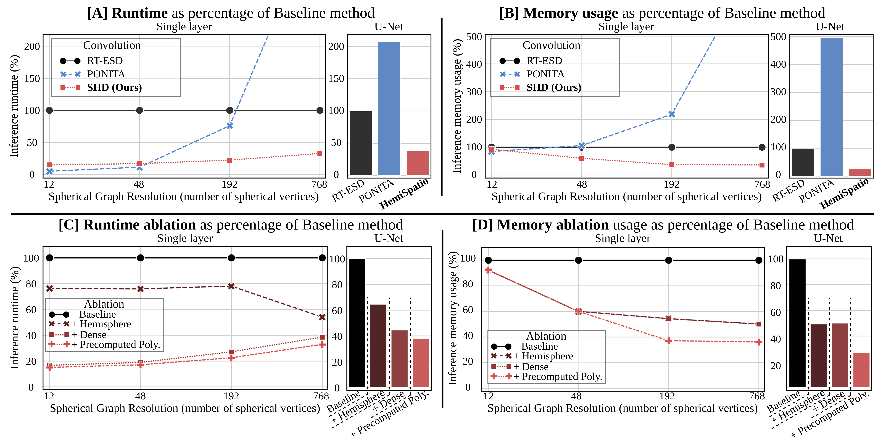
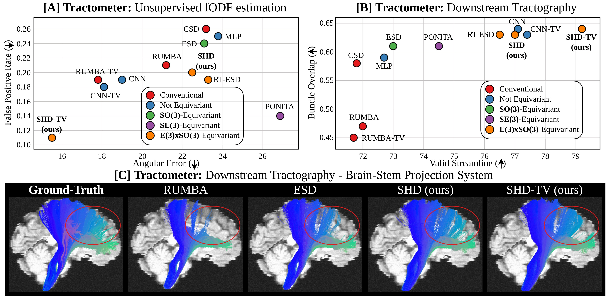

# Reproducing paper results

## 1. Running memory and speed benchmark

We provide the scripts to run the paper benchmark



```bash
cd conv_benchmark
# SHD results
python speed_layer_media.py --conv_name mixed
python speed_unet_media.py --conv_name mixed

# Ponita results
python speed_layer_media.py --conv_name bekkers
python speed_unet_media.py --conv_name bekkers

# RT-ESD results
python speed_layer_media.py --conv_name mixed --ablation
python speed_unet_media.py --conv_name mixed --ablation
```


## 2. Data

List of the dataset used in the paper:
1. The [HCP dataset](https://www.humanconnectome.org/study/hcp-young-adult/document/1200-subjects-data-release).
2. The [Tractometer dataset](https://tractometer.org/ismrm2015/dwi_data/).
3. The [DiSCo dataset](https://data.mendeley.com/datasets/fgf86jdfg6/3).

The dataset are pre-processed with [MRtrix3](https://mrtrix.readthedocs.io/en/latest/index.html) and [FSL](https://fsl.fmrib.ox.ac.uk/fsl/fslwiki).


## 3. DiSCo


1. Download the three volume file, move them, and rename them:
    * DiSCo{1 or 2 or 3}/high_resolution_40x40x40/DiSCo_DWI_RicianNoise-snr30.nii.gz --> ~/data/disco/DiSCo{1 or 2 or 3}/snr30/features.nii.gz
2. Download the three mask file, move them, and rename them:
    * DiSCo{1 or 2 or 3}/high_resolution_40x40x40/DiSCo{1 or 2 or 3}_mask.nii.gz --> ~/data/disco/DiSCo{1 or 2 or 3}/snr30/mask.nii.gz
3. Download the bvals file, move it, and rename it:
    * diffusion_gradients/DiSCo_gradients.bvals --> ~/data/disco/DiSCo{1 or 2 or 3}/snr30/bvals.bvals
4. Download the bvecs file, move it, and rename it:
    * diffusion_gradients/DiSCo_gradients_dipy.bvecs --> ~/data/disco/DiSCo{1 or 2 or 3}/snr30/bvecs.bvecs
5. Compute the response function using [MRtrix3](https://mrtrix.readthedocs.io/en/latest/index.html):
    * dwi2response dhollander ~/data/disco/DiSCo1/snr30/features.nii.gz ~/data/disco/DiSCo1/snr30/response_functions/dhollander/wm_response.txt ~/data/disco/DiSCo1/snr30/response_functions/dhollander/gm_response.txt ~/data/disco/DiSCo1/snr30/response_functions/dhollander/csf_response.txt -mask ~/data/disco/DiSCo1/snr30/mask.nii.gz -fslgrad ~/data/disco/DiSCo1/snr30/bvecs.bvecs ~/data/disco/DiSCo1/snr30/bvals.bvals
    * dwi2response dhollander ~/data/disco/DiSCo2/snr30/features.nii.gz ~/data/disco/DiSCo2/snr30/response_functions/dhollander/wm_response.txt ~/data/disco/DiSCo2/snr30/response_functions/dhollander/gm_response.txt ~/data/disco/DiSCo2/snr30/response_functions/dhollander/csf_response.txt -mask ~/data/disco/DiSCo2/snr30/mask.nii.gz -fslgrad ~/data/disco/DiSCo2/snr30/bvecs.bvecs ~/data/disco/DiSCo2/snr30/bvals.bvals
    * dwi2response dhollander ~/data/disco/DiSCo3/snr30/features.nii.gz ~/data/disco/DiSCo3/snr30/response_functions/dhollander/wm_response.txt ~/data/disco/DiSCo3/snr30/response_functions/dhollander/gm_response.txt ~/data/disco/DiSCo3/snr30/response_functions/dhollander/csf_response.txt -mask ~/data/disco/DiSCo3/snr30/mask.nii.gz -fslgrad ~/data/disco/DiSCo3/snr30/bvecs.bvecs ~/data/disco/DiSCo3/snr30/bvals.bvals
6. We provide the downsampled gradient file to run the low-angular resolution experiments. Move the file in config_files/disco/low_angular_resolution_mask to each of the discol volume folder.
7. We provide the ground-truth fODF peak file, download [here](https://drive.google.com/drive/folders/19NxL3TzhnT_g0-Sdgo2O323UZxjaPJf9?usp=drive_link), and move the ground-truth file peaks_unmask_normed_relative_stream.nii to the corresponding DiSCo volume root folder  ~/data/disco/DiSCo{1 or 2 or 3}/


### Training: High-angular resolution experiment

To train the HSD TV model in the paper, run this command:`
``bash
cd ..
```

```bash
# HSD-TV
python train.py --config config_files/disco/training/config_hsd_tv.yml
```

For benchmarked methods:
```bash
# HSD
python train.py --config config_files/disco/training/config_hsd.yml
# CNN
python train.py --config config_files/disco/training/config_cnn.yml
# CNN-TV
python train.py --config config_files/disco/training/config_cnn_tv.yml
# ESD
python train.py --config config_files/disco/training/config_esd.yml
# MLP
python train.py --config config_files/disco/training/config_mlp.yml
# PONITA
python train.py --config config_files/disco/training/config_ponita.yml
# RT-ESD
python train.py --config config_files/disco/training/config_rtesd.yml
```

### Training: Low-angular resolution experiment
```bash
# HSD-TV Low-Angular resolution
python train.py --config config_files/disco/training/config_hsd_tv_super.yml
```

### Evaluation

To evaluate model, run:

```bash
# HSD-TV
python test.py --config config_files/disco/testing/config_hsd_tv.yml
bash validation_scripts/disco/extract_peaks.sh config_files/disco/testing/config_hsd_tv.yml
```

For benchmarked methods:
```bash
# HSD
python test.py --config config_files/disco/testing/config_hsd.yml
bash validation_scripts/disco/extract_peaks.sh config_files/disco/testing/config_hsd_tv.yml
# CNN
python test.py --config config_files/disco/testing/config_cnn.yml
bash validation_scripts/disco/extract_peaks.sh config_files/disco/testing/config_cnn.yml
# CNN-TV
python test.py --config config_files/disco/testing/config_cnn_tv.yml
bash validation_scripts/disco/extract_peaks.sh config_files/disco/testing/config_cnn_tv.yml
# ESD
python test.py --config config_files/disco/testing/config_esd.yml
bash validation_scripts/disco/extract_peaks.sh config_files/disco/testing/config_esd.yml
# MLP
python test.py --config config_files/disco/testing/config_mlp.yml
bash validation_scripts/disco/extract_peaks.sh config_files/disco/testing/config_mlp.yml
# PONITA
python test.py --config config_files/disco/testing/config_ponita.yml
bash validation_scripts/disco/extract_peaks.sh config_files/disco/testing/config_ponita.yml
# RT-ESD
python test.py --config config_files/disco/testing/config_rtesd.yml
bash validation_scripts/disco/extract_peaks.sh config_files/disco/testing/config_rtesd.yml
```

## 4. Tractometer



1. We provide the pre-processed data and ground-truth fODF peak file here, download [here](https://drive.google.com/drive/folders/19NxL3TzhnT_g0-Sdgo2O323UZxjaPJf9?usp=drive_link). Save the folder under ~/data/ismrm/train_data/

### Training
To train the HSD TV model in the paper, run this command:

```bash
# HSD-TV
python train.py --config config_files/tractometer/training/config_hsd_tv.yml
```

For benchmarked methods:
```bash
# HSD
python train.py --config config_files/tractometer/training/config_hsd.yml
# CNN
python train.py --config config_files/tractometer/training/config_cnn.yml
# CNN-TV
python train.py --config config_files/tractometer/training/config_cnn_tv.yml
# ESD
python train.py --config config_files/tractometer/training/config_esd.yml
# MLP
python train.py --config config_files/tractometer/training/config_mlp.yml
# PONITA
python train.py --config config_files/tractometer/training/config_ponita.yml
# RT-ESD
python train.py --config config_files/tractometer/training/config_rtesd.yml
```

### Testing
To train the HSD TV model in the paper, run this command:

```bash
# HSD-TV
python test.py --config config_files/tractometer/testing/config_hsd_tv.yml
bash validation_scripts/tractometer/extract_peaks.sh config_files/tractometer/testing/config_hsd_tv.yml
bash validation_scripts/tractometer/extract_tracks.sh config_files/tractometer/testing/config_hsd_tv.yml
```

For benchmarked methods:
```bash
# HSD
python test.py --config config_files/tractometer/testing/config_hsd.yml
bash validation_scripts/tractometer/extract_peaks.sh config_files/tractometer/testing/config_hsd_tv.yml
bash validation_scripts/tractometer/extract_tracks.sh config_files/tractometer/testing/config_hsd_tv.yml
# CNN
python test.py --config config_files/tractometer/testing/config_cnn.yml
bash validation_scripts/tractometer/extract_peaks.sh config_files/tractometer/testing/config_cnn.yml
bash validation_scripts/tractometer/extract_tracks.sh config_files/tractometer/testing/config_cnn.yml
# CNN-TV
python test.py --config config_files/tractometer/testing/config_cnn_tv.yml
bash validation_scripts/tractometer/extract_peaks.sh config_files/tractometer/testing/config_cnn_tv.yml
bash validation_scripts/tractometer/extract_tracks.sh config_files/tractometer/testing/config_cnn_tv.yml
# ESD
python test.py --config config_files/tractometer/testing/config_esd.yml
bash validation_scripts/tractometer/extract_peaks.sh config_files/tractometer/testing/conficonfig_esdg_hsd_tv.yml
bash validation_scripts/tractometer/extract_tracks.sh config_files/tractometer/testing/config_esd.yml
# MLP
python test.py --config config_files/tractometer/testing/config_mlp.yml
bash validation_scripts/tractometer/extract_peaks.sh config_files/tractometer/testing/config_mlp.yml
bash validation_scripts/tractometer/extract_tracks.sh config_files/tractometer/testing/config_mlp.yml
# PONITA
python test.py --config config_files/tractometer/testing/config_ponita.yml
bash validation_scripts/tractometer/extract_peaks.sh config_files/tractometer/testing/config_ponita.yml
bash validation_scripts/tractometer/extract_tracks.sh config_files/tractometer/testing/config_ponita.yml
# RT-ESD
python test.py --config config_files/tractometer/testing/config_rtesd.yml
bash validation_scripts/tractometer/extract_peaks.sh config_files/tractometer/testing/config_rtesd.yml
bash validation_scripts/tractometer/extract_tracks.sh config_files/tractometer/testing/config_rtesd.yml
```

### For tractography results
We refer to the Tractometer instruction [here](https://tractometer.org/ismrm2015/tools/) to set up the python environment and download ground truth fiber bundles.
